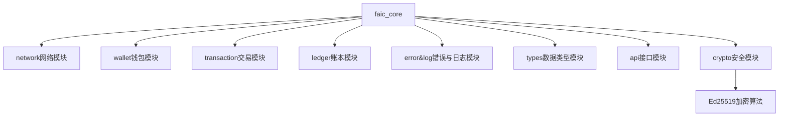

# MVP001版本要求：

核心目标：实现FAIC钱包的创建、助记词导入、转账、查询余额等功能。

开发要求：
1、节点程序使用rust开发，network网络模块使用libp2p框架.。
2、先开发节点程序，使用openapi规范API接口，通过curl命令行工具对各个功能测试验证，完善API文档后，再开发客户端。
3、代码中要有详细的注释，包括函数、结构体、枚举等。
4、要在代码中加入恰当的打印，方便调试。
5、客户端使用flutter开发。

# MVP001 开发计划

## 项目框架



## FAIC代币经济模型
1、FAIC数量不限定总额。
2、每年年底FAIC增发3%，这3%用于奖励智能合约模块的参与者。
3、pos质押和智能合约为参与者创造收入时，收取0.3%或更高的手续费。未创造收入时，不收取手续费。
4、应当考虑到后续补充的机制，不需要开发，但是需要考虑到可扩展性：
  1、添加代币销毁机制
  2、挖矿机制
  3、流动性管理策略
  4、紧急暂停机制
  5、治理机制以调整参数

## FAIC奖励办法（测试暂行办法）
1、提供算力并获得验证：获得1FAIC/1tokens的奖励
2、提供路由服务并获得验证：获得15FAIC/1request的奖励
3、验证其他节点提供算力或路由服务：获得30FAIC/1request的奖励
4、算力节点在线时长并获得验证：获得60FAIC/1hour的奖励
5、验证节点在线时长并获得验证：获得60FAIC/1hour的奖励
6、用户在官网捐赠给FAIW公共钱包，即可获得FAIC。
7、路由服务奖励机制：
   a) 在线时长：10FAIC/1hour，每半小时遍历一次节点。
   b) 成功匹配次数：3FAIC/1request


### 数据类型

#### Amount
```rust
Amount 数据类型： // done
   基础数据类型：biguint
   DECIMALS: u32 = 8; //最小单位: 1 (0.00000001 FAIC),实际精度:8位小数。采用doge的精度
   ONE_FAIC: &'static str = "100000000"; // 10^8
   MAX_AMOUNT: &'static str = "340282366920938463463374607431768211455"; // 2^128 - 1
   最小交易额 0.00000001 FAIC = 1
```


### 必要的功能实现
1、钱包的创建、助记词导入、转账、余额查询


## 3. 节点程序开发阶段

### Phase 1: 基础设施搭建 (1周)
- 搭建项目框架
- 实现核心接口定义
- 设置基本的错误处理
- 配置日志系统

### Phase 2: 钱包核心功能 (2周)
1. 钱包创建
   - 生成私钥
   - 生成助记词
   - 创建钱包地址

2. 助记词导入
   - 助记词验证
   - 私钥恢复
   - 地址重建

### Phase 3: 网络功能 (2周)
1. 基本网络连接
   - 节点发现
   - 连接管理
   - 心跳检测

2. 交易广播
   - 交易序列化
   - 广播机制
   - 确认机制

### Phase 4: 账户功能 (1周)
1. 余额查询
   - 账户状态同步
   - 余额更新机制

2. 转账功能
   - 交易构建
   - 签名验证
   - 交易提交

### Phase 5: 测试与优化 (1周)
1. 单元测试
   - 接口测试
   - 功能测试
   - 边界测试

2. 集成测试
   - 网络测试
   - 性能测试
   - 压力测试