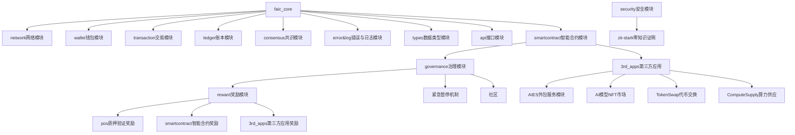

# MVP001版本要求：

核心目标：实现FAIC钱包的创建、助记词导入、转账、查询余额等功能。

开发要求：
1、节点程序使用rust开发，要求网络协议采用p2p框架。
2、先开发节点程序，使用openapi规范API接口，通过curl命令行工具对各个功能测试验证，完善API文档后，再开发客户端。
3、代码中要有详细的注释，包括函数、结构体、枚举等。
4、要在代码中加入恰当的打印，方便调试。
5、客户端使用flutter开发。

# MVP001 开发计划

## 项目框架



## FAIC代币经济模型
1、FAIC数量不限定总额。
2、每年年底FAIC增发3%，这3%用于奖励智能合约模块的参与者。
3、pos质押和智能合约为参与者创造收入时，收取0.3%或更高的手续费。未创造收入时，不收取手续费。
4、应当考虑到后续补充的机制，不需要开发，但是需要考虑到可扩展性：
  1、添加代币销毁机制
  2、挖矿机制
  3、流动性管理策略
  4、紧急暂停机制
  5、治理机制以调整参数

## FAIC奖励办法（测试暂行办法）
1、提供算力并获得验证：获得1FAIC/1tokens的奖励
2、提供路由服务并获得验证：获得15FAIC/1request的奖励
3、验证其他节点提供算力或路由服务：获得30FAIC/1request的奖励
4、算力节点在线时长并获得验证：获得60FAIC/1hour的奖励
5、验证节点在线时长并获得验证：获得60FAIC/1hour的奖励
6、用户在官网捐赠给FAIW公共钱包，即可获得FAIC。
7、路由服务奖励机制：
   a) 在线时长：10FAIC/1hour，每半小时遍历一次节点。
   b) 成功匹配次数：3FAIC/1request


### 数据类型

#### Node
```rust
Node 数据类型： // todo 

```

#### Amount
```rust
Amount 数据类型： // done
   基础数据类型：biguint
   DECIMALS: u32 = 8; //最小单位: 1 (0.00000001 FAIC),实际精度:8位小数。采用doge的精度
   ONE_FAIC: &'static str = "100000000"; // 10^8
   MAX_AMOUNT: &'static str = "340282366920938463463374607431768211455"; // 2^128 - 1
   最小交易额 0.00000001 FAIC = 1
```

### 1.1 接口定义 (Interfaces)

```rust
/// P2P 网络核心接口
pub trait P2PNetworkInterface {
   // 节点发现与管理
   async fn discover_Node_list(&self) -> Result<Vec<NodeInfo>>;
   async fn connect_Node(&self, Node: NodeInfo) -> Result<()>;
   async fn disconnect_Node(&self, Node_id: NodeId) -> Result<()>;
   
   // 消息传输
   async fn broadcast_message(&self, message: NetworkMessage) -> Result<()>;
   async fn send_message(&self, Node_id: NodeId, message: NetworkMessage) -> Result<()>;
   
   // 状态同步
   async fn sync_state(&self) -> Result<()>;
   async fn get_Node_state(&self, Node_id: NodeId) -> Result<NodeState>;
}

/// P2P 网络实现
pub struct P2PNetwork {
   // 节点标识
   node_id: NodeId,
   // 节点类型
   node_type: NodeType,
   // 连接管理器
   connection_manager: ConnectionManager,
   // 消息处理器
   message_handler: MessageHandler,
   // 状态管理器
   state_manager: StateManager,
   // 计算资源管理
   compute_manager: ComputeManager,      
   // 验证管理
   validation_manager: ValidationManager, 
   // 奖励管理
   reward_manager: RewardManager,        
}

/// 消息类型
#[derive(Debug, Clone, Serialize, Deserialize)]
pub enum NetworkMessage {
   // 钱包相关
   CreateWallet(CreateWalletRequest),
   ImportWallet(ImportWalletRequest),
   GetBalance(GetBalanceRequest),
   Transfer(TransferRequest),
   
   // 节点状态
   NodeState(NodeStateMessage),
   // 节点发现
   DiscoverNodes(DiscoverNodesRequest),
   NodeList(Vec<NodeInfo>),
   
   // 响应消息
   Response(ResponseMessage),

   // 计算相关
   SubmitCompute(ComputeRequest),
   ComputeResult(ComputeResponse),
   
   // 验证相关
   ValidationRequest(ValidationRequest),
   ValidationResult(ValidationResponse),
   
   // 奖励相关
   RewardClaim(RewardClaimRequest),
   RewardDistribution(RewardDistributionMessage),
}
```


### 1.3 必要的服务实现

```rust
// 1. wallet钱包模块
pub struct WalletService {
   crypto: Arc<BasicCrypto>,
   network: Arc<BasicNetwork>,
}
// 2. transaction交易模块
pub struct TransactionService {
   network: Arc<BasicNetwork>,
   consensus: Arc<SimpleConsensus>,
}

//3. reward奖励模块
```
## 2.错误处理和日志记录的标准接口
### 2.1 错误类型定义
文件位置：faic_node/src/error/error.rs
```rust
/// 标准错误类型枚举
#[derive(Debug, Clone)]
pub enum FAICError {
   // 网络错误
   NetworkError(NetworkErrorKind),
   // 计算错误
   ComputeError(ComputeErrorKind),
   // 验证错误
   ValidationError(ValidationErrorKind),
   // 安全错误
   SecurityError(SecurityErrorKind),
   // 资源错误
   ResourceError(ResourceErrorKind),
   // 状态错误
   StateError(StateErrorKind),
   // 用户错误
   UserError(UserErrorKind),
}

/// 网络错误类型
#[derive(Debug, Clone)]
pub enum NetworkErrorKind {
   ConnectionFailed,
   Timeout(Duration),
   NodeNotFound(NodeId),
   MessageTooLarge(usize),
   InvalidProtocol,
}

/// 计算错误类型
#[derive(Debug, Clone)]
pub enum ComputeErrorKind {
   ResourceExhausted,
   ModelNotFound(String),
   TaskFailed(String),
   InvalidInput,
   VLLMError(String),
}

/// 验证错误类型
#[derive(Debug, Clone)]
pub enum ValidationErrorKind {
   InvalidSignature,
   InvalidBlock,
   InvalidTransaction,
   ConsensusError,
   StakeInsufficient,
}
```

### 2.2 日志接口定义
文件位置：src/core/logger.rs
```rust
/// 日志级别
#[derive(Debug, Clone, Copy)]
pub enum LogLevel {
   Error,
   Warn,
   Info,
   Debug,
   Trace,
}

/// 日志上下文
#[derive(Debug, Clone)]
pub struct LogContext {
   timestamp: DateTime<Utc>,
   node_id: NodeId,
   node_type: NodeType,
   component: String,
   trace_id: String,
   user_id: Option<String>,
}

/// 日志记录接口
pub trait LoggerInterface: Send + Sync {
   /// 记录日志
   fn log(&self, level: LogLevel, context: LogContext, message: String);
   
   /// 记录错误
   fn error(&self, context: LogContext, error: FAICError);
   
   /// 记录指标
   fn metric(&self, context: LogContext, name: String, value: f64);
   
   /// 记录事件
   fn event(&self, context: LogContext, event_type: String, data: serde_json::Value);
}
```

### 2.3 错误处理接口
```rust
/// 错误处理接口
pub trait ErrorHandler: Send + Sync {
   /// 处理错误
   async fn handle_error(&self, error: FAICError, context: LogContext) -> Result<(), FAICError>;
   
   /// 重试策略
   async fn retry<F, T>(&self, f: F, max_retries: u32) -> Result<T, FAICError>
   where
      F: Fn() -> Future<Output = Result<T, FAICError>>;
   
   /// 错误恢复
   async fn recover(&self, error: FAICError) -> Result<(), FAICError>;
   
   /// 错误通知
   async fn notify(&self, error: FAICError, severity: LogLevel);
}

/// 错误监控接口
pub trait ErrorMonitor: Send + Sync {
   /// 监控错误率
   async fn monitor_error_rate(&self, window: Duration) -> Result<f64, FAICError>;
   
   /// 监控资源状态
   async fn monitor_resources(&self) -> Result<ResourceStatus, FAICError>;
   
   /// 监控节点健康状态
   async fn monitor_node_health(&self) -> Result<NodeHealth, FAICError>;
}
```
## 3. 节点程序开发阶段

### Phase 1: 基础设施搭建 (1周)
- 搭建项目框架
- 实现核心接口定义
- 设置基本的错误处理
- 配置日志系统

### Phase 2: 钱包核心功能 (2周)
1. 钱包创建
   - 生成私钥
   - 生成助记词
   - 创建钱包地址

2. 助记词导入
   - 助记词验证
   - 私钥恢复
   - 地址重建

### Phase 3: 网络功能 (2周)
1. 基本网络连接
   - 节点发现
   - 连接管理
   - 心跳检测

2. 交易广播
   - 交易序列化
   - 广播机制
   - 确认机制

### Phase 4: 账户功能 (1周)
1. 余额查询
   - 账户状态同步
   - 余额更新机制

2. 转账功能
   - 交易构建
   - 签名验证
   - 交易提交

### Phase 5: 测试与优化 (1周)
1. 单元测试
   - 接口测试
   - 功能测试
   - 边界测试

2. 集成测试
   - 网络测试
   - 性能测试
   - 压力测试